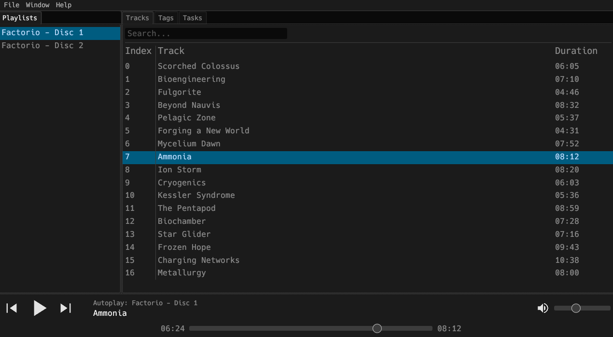

# daemos

A local-only music player

[![CI][s1]][l1] [![Latest version][s2]][l2] [![unsafe][s3]][l3] [![MIT][s4]][l4] [![Apache][s5]][l5]

[s1]: https://github.com/Xithrius/daemos/actions/workflows/ci.yml/badge.svg
[l1]: https://github.com/Xithrius/daemos/actions/workflows/ci.yml

[s2]: https://img.shields.io/crates/v/daemos.svg
[l2]: https://crates.io/crates/daemos

[s2]: https://img.shields.io/badge/unsafe-forbidden-success.svg
[l2]: https://github.com/rust-secure-code/safety-dance/

[s3]: https://img.shields.io/badge/license-MIT-blue.svg
[l3]: https://github.com/Xithrius/daemos/blob/main/LICENSE-MIT

[s4]: https://img.shields.io/badge/license-Apache-blue.svg
[l4]: https://github.com/Xithrius/daemos/blob/main/LICENSE-APACHE

## More information

If you have any problems, do not hesitate to [submit an issue](https://github.com/Xithrius/daemos/issues/new/choose).

This project follows the guidelines of [Semantic Versioning](https://semver.org/).

Built with [Rust](https://github.com/rust-lang/rust) and [egui](https://github.com/emilk/egui).
